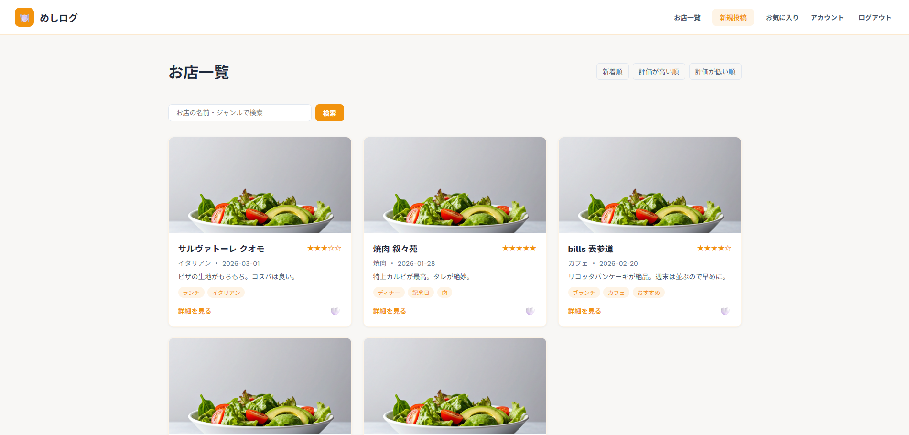
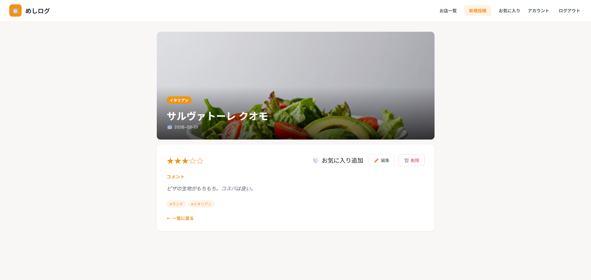
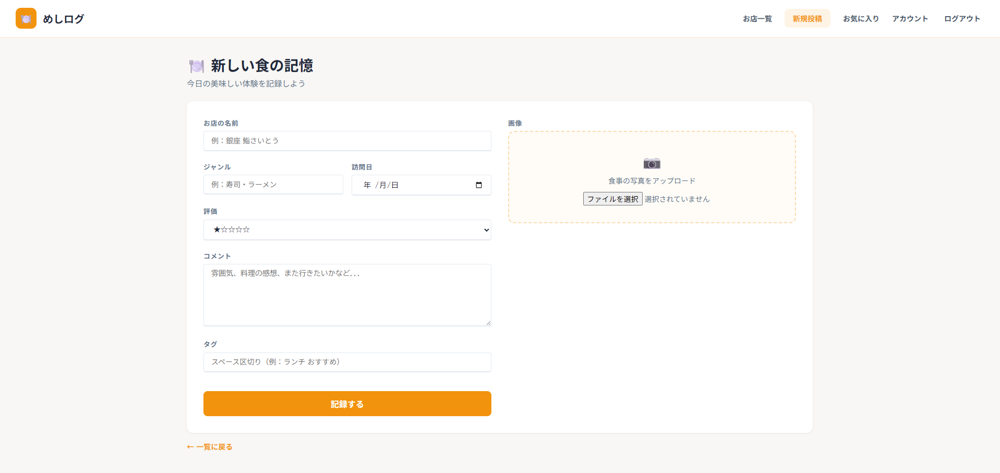
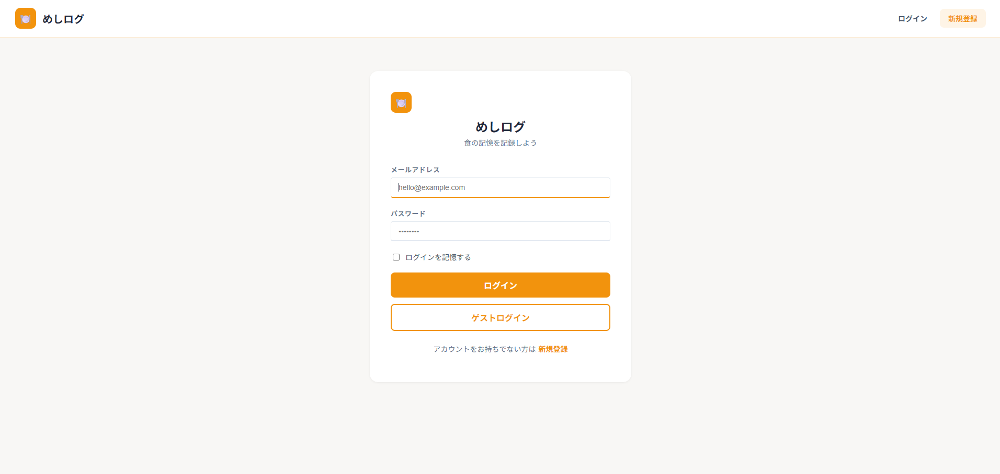
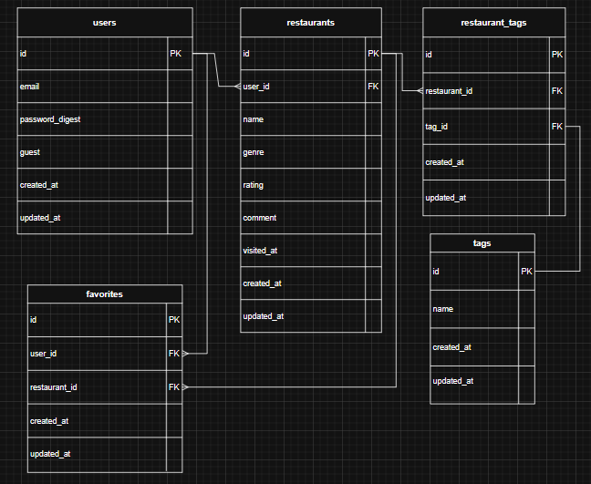

# めしログ

## 開発背景

食べたお店の記録をSNSに残していたものの、「いいね」や見栄えを意識するうちに、**自分がどう感じたか**という本質がぼやけていくと感じていました。食の感想は人それぞれで、周りの評価より自分の感覚が大切だと思い、このアプリを開発しました。

## このアプリで解決できること

- 自分だけの食の記録を蓄積できる
- 「辛い」「おすすめ」「記念日」など**自分の言葉でタグ分類**できる
- SNSのように他人の目を気にせず、純粋に自分の感想を残せる
- タグ・ジャンル・評価で絞り込めるので、過去の記録をすぐに見つけられる

## URL

https://meshi-log-z3o6.onrender.com

ゲストログインボタンからすぐに機能を体験できます。

## スクリーンショット

### お店一覧

### 詳細ページ

### 新規投稿

### ログイン

## 機能一覧

- ユーザー登録・ログイン・ログアウト（Devise）
- ゲストログイン
- お店の投稿・編集・削除
- 画像アップロード（ActiveStorage）
- お気に入り追加・解除・一覧表示
- タグ機能（スペース区切りで複数登録・クリックで絞り込み）
- 検索機能（お店名・ジャンルで検索）
- 並び替え（新着順・評価順）
- ページネーション（kaminari）
- ゲストユーザーへの操作制限
- 他ユーザーの投稿へのアクセス制限

## 使用技術

| 技術 | バージョン |
|------|-----------|
| Ruby | 3.3.3 |
| Rails | 7.2.3 |
| PostgreSQL | - |

## インフラ

- Render（Webサーバー・データベース）

## ER図

## 工夫した点

- **ゲストユーザーにサンプルデータを用意**:ログイン直後から機能を体験できるようにした
- **ゲストユーザーへの操作制限**：閲覧のみ可能とし、投稿・編集・削除・お気に入り操作を禁止
- **`request.referer`を活用**：一覧・詳細どちらからお気に入り操作しても元のページに戻れるようにした
- **CSSファイルの分離**：役割ごとにCSSファイルを分離し、保守性を高めた
